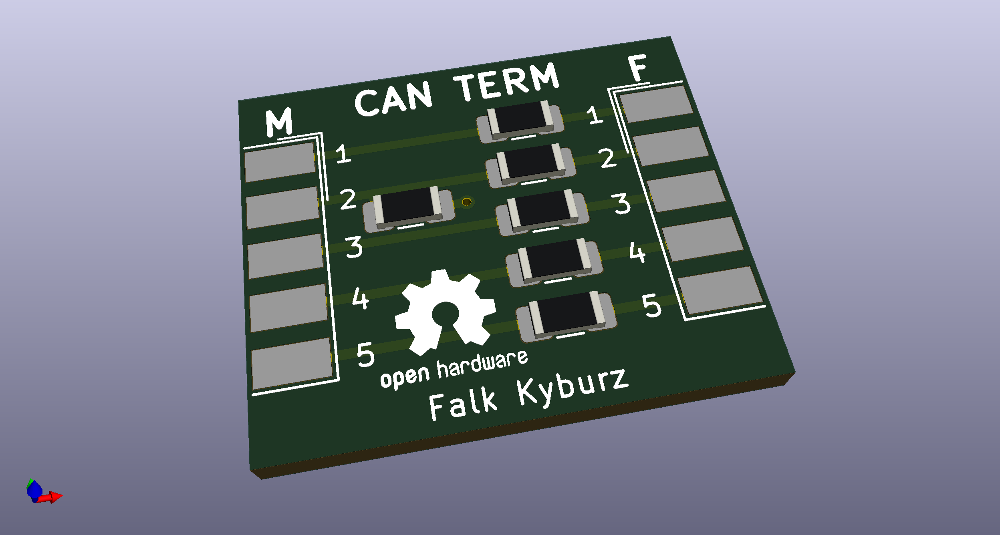

# CAN Termination

This D-SUB 9 standard CAN pinout terminaton adapter. It inserts a 120 Ohm resistor between the CAN-H and CAN-L signals.

## BOM

I also included the interactive html BOM (canterm.html) 

| References     | Value                     | Footprint | Quantity |
|----------------|---------------------------|-----------|----------|
| R1             | 120R                      | 1206      | 1        |
| R2 - R10       | 0R                        | 1206      | 9        |
| J1             | DB9 Male                  |           | 1        |
| J2             | DB9 Female                |           | 1        |
